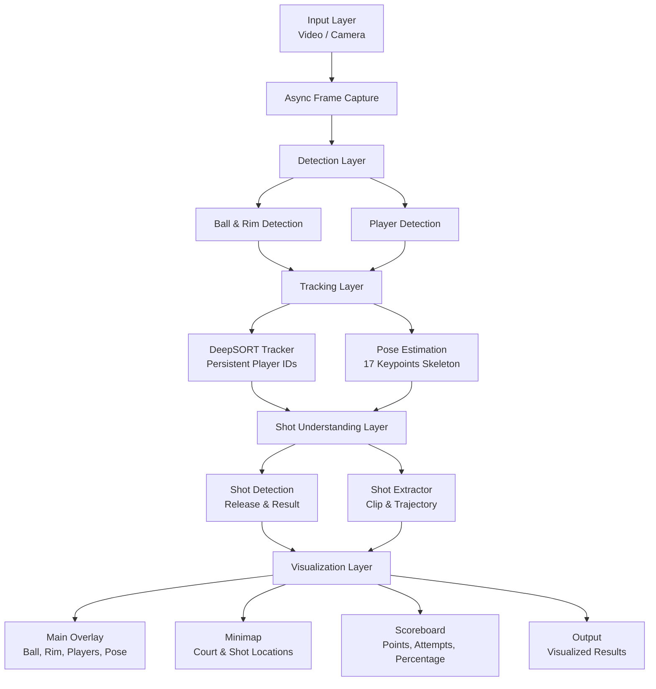

# Basketball AI Training App

## Overview

This project focuses on basketball shooting analysis and training, going beyond traditional applications that only count made shots.

The main objective is to analyze a player’s shooting pose, ball trajectory, and shot outcome to provide meaningful feedback that can help improve shooting technique.
Instead of focusing on dribbling or basic statistics, the system is designed around pose-aware shot understanding and correction.

The application supports outdoor basketball videos and is designed to work with real game or training footage.

## Architecture

The system is organized into modular layers to ensure flexibility and extensibility.




##Images from Project

## Current Status
- A custom dataset has been created 
- Hoop detection is working reliably
- Ball trajectory and scoring system are implemented
- Double counting issue has been resolved
- A minimap for player and ball visualization has been added (still needs refinement during player jumps)
- Score system added, now including 2-point and 3-point differentiation
- Player detection system implemented


Demo : https://youtu.be/inXI5wmToNo
  

## Future Work
- Improve pose correction using keypoint detection methods
- Provide personalized training feedback based on body alignment and release angle
- Add shot analysis tools (release angle, stability, follow-through evaluation)
- Enhance minimap projection for smoother tracking
- Mobile deployment for real-time use

## Models
- Rim and ball detection --> https://huggingface.co/naakgs/ballAndHoopDetector/tree/main


## How to Run

### 1. Clone the repository

```bash
git clone https://github.com/your-username/your-repo-name.git
cd your-repo-name
```

### 2. Create and activate virtual environment

```bash
python -m venv venv
conda create -n basketball-app python=3.12
source venv/bin/activate   # Linux / Mac
venv\Scripts\activate      # Windows
```

### 3. Install dependencies

Install all required libraries from `requirements.txt`:

```bash
pip install -r requirements.txt
```

### 4. Download the models

Rim and ball detection model is hosted on Hugging Face.
Download it into the `models/` folder:

```bash
git lfs install
git clone https://huggingface.co/naakgs/ballAndHoopDetector models/ballAndHoopDetector
```

### 5. Run the application

Run the main script with your video input:

```bash
python BasketballAIApp/BasketballTrainingApp/ScoreDetector/tracking.py
```

### 6. Output

* Hoop and ball are detected with bounding boxes.
* Ball trajectory and scoring events are displayed on screen.
* A minimap with player and ball visualization is shown.

### 7. Example Demo

You can check a working demo here:
[Demo Video](https://youtu.be/inXI5wmToNo)
